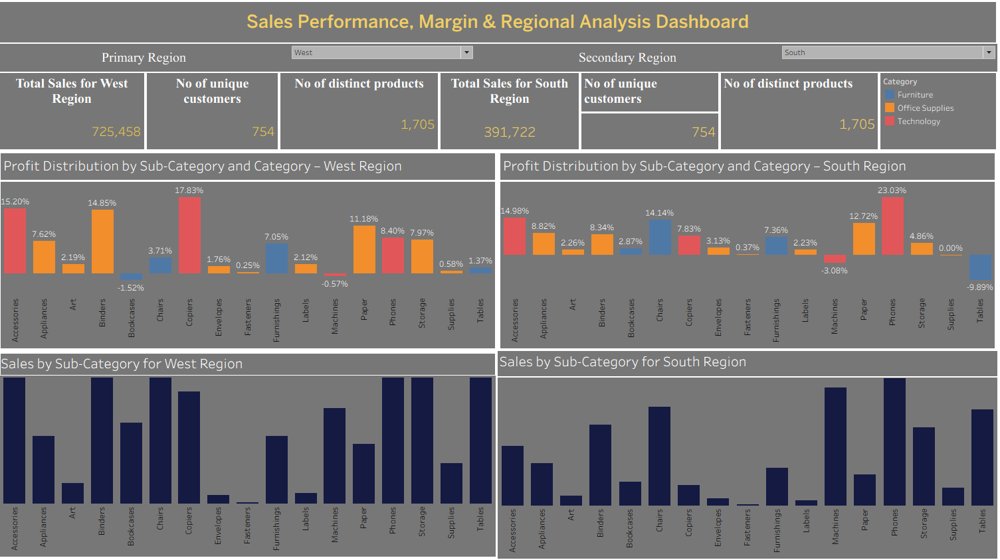

# 📊 Sales Performance, Margin & Regional Analysis Dashboard (Tableau)
This project provides a comprehensive analysis of sales performance across multiple regions, product categories, and customer segments. The interactive Tableau dashboard highlights key trends in sales, profit margins, and regional performance, enabling stakeholders to identify growth opportunities and address profitability gaps.

## 🎯 Objective
To analyse large-scale sales data and build an interactive Tableau dashboard that helps commercial and finance teams evaluate regional performance, category-level profitability, and margin trends for data-driven decision-making

## 🛠 Tools & Technologies
- Tableau Desktop
- Dashboarding & Data Visualization
- Excel / CSV Sales Dataset

## 📊 Dashboard Features
- **Regional KPIs**: Total sales, unique customers, and product counts by region
- **Sales Distribution**: Category and sub-category level sales trends
- **Profit & Margin Analysis**: Profit margin distribution across regions and categories
- **Regional Comparison**: Side-by-side metrics for primary and secondary regions
- **Interactive Controls**: Filters, category selections, and hover insights for deeper analysis

## 📸 Dashboard Preview

## 🔍 Process
- Analysed 15,000+ sales records to evaluate performance trends, margin variations, and profitability drivers across multiple regions.
- Designed and deployed an interactive, multi-layered Tableau dashboard enabling drilldowns into regions, categories, and sub-categories.
- Automated weekly and monthly performance reporting, improving reporting efficiency by 25% and maintaining consistent accuracy.

## ✅ Result & Business Impact
This dashboard improved data visibility and enabled teams to:
- Monitor regional and category-level sales performance
- Identify margin risks and profitability gaps
- Access real-time insights for forecasting and commercial planning
- Make informed, data-driven decisions with confidence

## 🚀 How to Use This Project
- **1.** Clone or download the repository.
- **2.** Open the .twbx file in Tableau Desktop or Tableau Public.
- **3.** Interact with filters and visuals to explore sales, margin, and regional insights.
